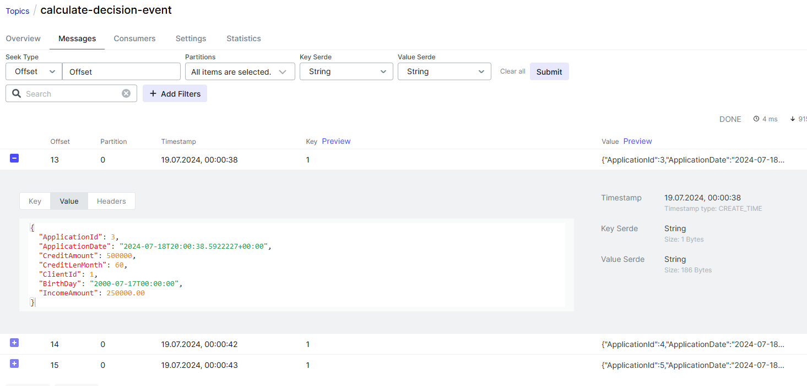
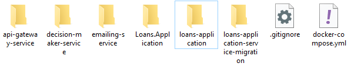

# Loans-application
### Веб-приложение для создания клиентов и заявок на выдачу кредита.
### Stack: C#, ASP.NET Core, Entity Framework, PostgreSQL, DbUp, Apache Kafka, Docker Compose.
## Микросервисная архитектура состоит из следующих компонентов:
### 1. LoansApplicationHost - внутренний API-сервис для создания клиентов и заявок
### 2. LoansApplicationDb - база данных для хранения клиентов и заявок
### 3. DecisionMakerService - сервис принятия решений по кредитной заявке
### 4. DecisionMakerServiceDb - база данных для хранения решений по заявкам
### 5. LoansApplicationServiceMigration - сервис для накатывания миграции к базе данных клиентов и заявок при помощи DbUp
### 6. KafkaService - сервер кафки для асинхронного взаимодействия с сервисом принятия решений
### 7. KafkaUi - графический интерфейс для работы с кафкой
### 8. ApiGatewayService - внешний API-сервис для клиентов, который проксирует вызовы на методы сервиса LoansApplicationHost (в разработке)
### 9. EmailingService - сервис для асинхронного оповещения клиентов по электронной почте о принятом решении по кредитной заявке (в разработке)


### 1. Метод clients/create добавляет нового клиента. Добавим 3-х клиентов и проверим бд:


### 2. Метод clients/filter возвращает клиентов по фильтру: фамилия, имя, отчество, нижняя и верхняя границы даты рождения и зарплаты. На  запросе
```json
{
  "middleName": "В"
}
```
### получим двух клиентов, отчества которых начинаются на букву "В":

### На пустом запросе вернутся все имеющиеся клиенты:
```json
{
}
```

### 3. Для проверки метода создания кредитной заявки локально, должны быть развёрнуты сервис принятий решений, его база данных и сервер Kafka в Docker.
### Вызовем три раза метод /loans/create c запросом:
```json
{
  "clientId": 1,
  "desiredAmount": 500000,
  "period": 60
}
```
### В KafkaUi у нас есть два топика calculate-decision-event, который содержит запросы на принятие решение по заявке, и calculate-decision-event-result, который содержит ответы на эти запросы. При вызове метода /loans/create создаётся запись в бд с пустыми полями и отправляется сообщение в топик calculate-decision-event. Далее сервис принятия решений получает это сообщение, выполняет свою логику и отправляет результат в топик calculate-decision-event-result. После чего loans-application-host получает это сообщение из топика calculate-decision-event-result и обновляет запись бд с соответствующим id полями из этого сообщения.

### В топике calculate-decision-event есть три сообщения:

### Аналогично в топике calculate-decision-event-result находится три ответа на эти сообщения:

### Проверим в локально развёрнутой бд наличие заявок:

## 4. /loans/{loanId}/status - получение статуса заявки по её идентификатору
## 5. /loans/{clientId}/loans - получение всех заявок клиента по его идентификатору
## 6. /loans/{id} - получение заявки по её идентификатору
## 7. /loans/{clientId}/loan-ids - получение идентификаторов всех заявок клиента по его идентификатору
## Для локального запуска приложения нужно:
### 1. Задать в файле appsettings.json в директориях
```
./Loans.Application/Loans.Application/Loans.Application.Migrations/bin/Debug/net7.0

./Loans.Application/Loans.Application/src/Loans.Application
``` 
### свою строку подключения к базе данных PostgreSQL:
```json
"ConnectionStrings": {
  "loans-application-service-db-connection": "User ID=[Ваше имя];Password=[Ваш пароль];Host=localhost;Port=5432;Database=loans-application;"
},
```
### 2. Создать базу данных loans-application на вашем локальном сервере PostgreSQL.
### 3. Запустить сервис Loans.Application.Migrations для накатки миграции.
### 4. Запустить сервис Loans.Application.Host

## Для развёртывания сервисов в Docker Compose нужно:
### 1. Из самой верхней директории выполнить команду и дождаться её завершения:
```ps
docker-compose up --build -d
```
### Эта команда собирает образы всех сервисов описанных в файле docker-compose.yml и запускает их в фоновом режиме.

### 2. Добавить строку подключения для loans-application-service-migration и loans-application.

### 3. Открыть web-host по адресу http://localhost:2023/swagger/index.html